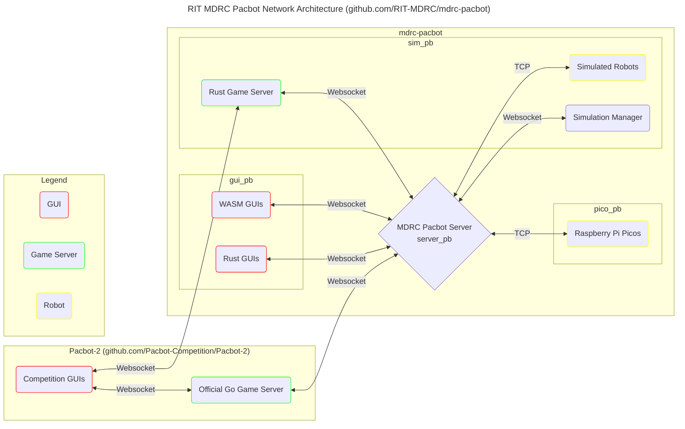

```mermaid
---
title: RIT MDRC Pacbot Network Architecture (github.com/RIT-MDRC/mdrc-pacbot)
---
flowchart LR
    subgraph Legend
        direction TB
        Y(GUI):::gui
        Z(Game Server):::game_server
        X(Robot):::robot
    end
    %% ensure the legend is vertical
    Y ~~~ A 
    subgraph "mdrc-pacbot"
        A(WASM GUIs):::gui & B(Rust GUIs):::gui <-->|Websocket| D{MDRC Pacbot Server\nserver_pb}
        D <-->|TCP| E(Raspberry Pi Picos):::robot
        D <-->|TCP| F(Simulated Robots):::robot
        D <-->|Websocket| J(Simulation Manager)
        I(Rust Game Server):::game_server <-->|Websocket| D
        subgraph gui_pb
            A
            B
        end
        subgraph pico_pb
            E
        end
        subgraph sim_pb
            I
            J
            F
        end
    end
    subgraph "Pacbot-2 (github.com/Pacbot-Competition/Pacbot-2)"
        C(Competition GUIs):::gui <-->|Websocket| G(Official Go Game Server):::game_server
    end
    C <-->|Websocket| I
    G <-->|Websocket| D

    classDef gui stroke:#f00
    classDef game_server stroke:#0f0
    classDef robot stroke:#ff0
```